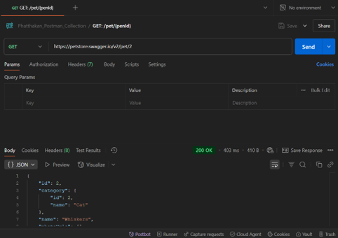
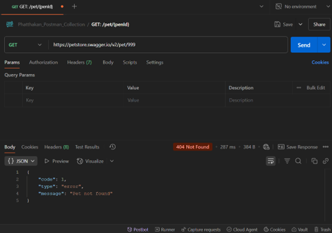
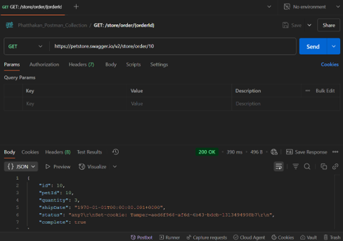
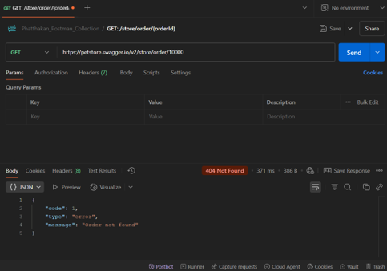
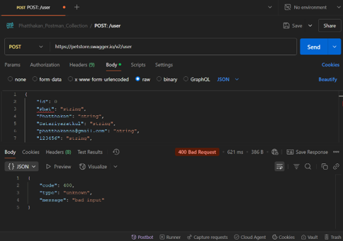
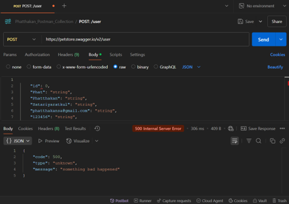

# 🧪 Postman API Collection - Petstore Swagger

This Postman collection includes 3 API requests from the [Swagger Petstore](https://petstore.swagger.io/):

---

## 🔗 API Endpoints

response code meaning
| response code     | meaning               |
|-------------------|-----------------------|
| 200               | Successful responses  |
| 400               | Bad Request           |
| 404               | Not Found             |
| 500               | Internal Server Error |


### 1. GET: /pet/{petId}
- **Description:** Get pet information by ID
- **Sample:** `/pet/2`

| response code      | Picture                    |
|--------------------|----------------------------|
| 200                |   |
| 404                |   |

### 2. GET: /store/order/{orderId}
- **Description:** Get order details by ID
- **Sample:** `/store/order/10`

| response code      | Picture                    |
|--------------------|----------------------------|
| 200                |   |
| 404                |   |

### 3. POST: /user
- **Description:** Create a new user
- **Body Example:**
```json
{
  "id": 0,
  "username": "Phat",
  "firstName": "Phatthakan",
  "lastName": "Satariyaratkul",
  "email": "phatthakansa@gmail.com",
  "password": "123456",
  "phone": "1234567890",
  "userStatus": 1
}
```
| response code      | Picture                    |
|--------------------|----------------------------|
| 200                |   |
| 400                |   |
| 500                |   |
